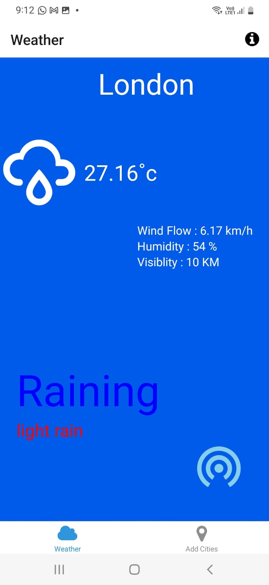
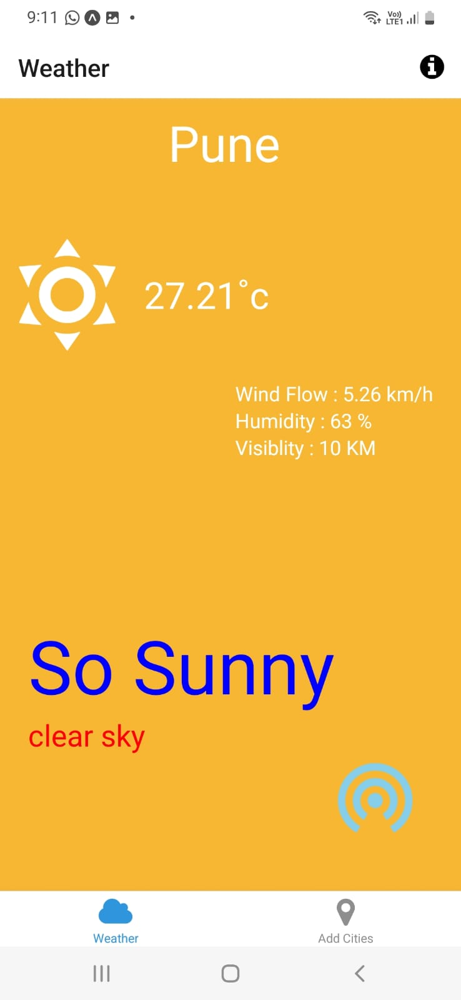
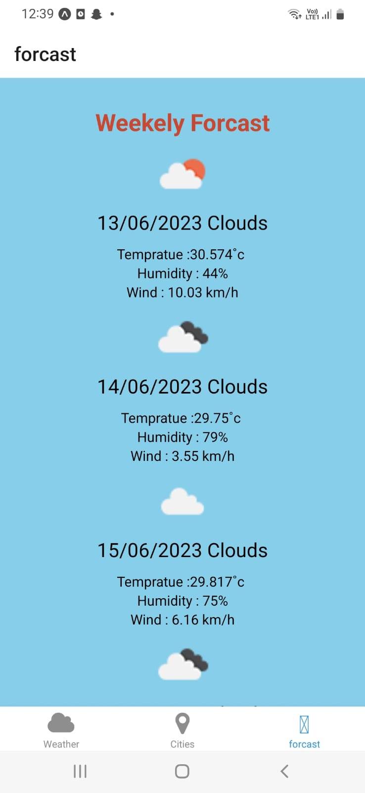

## Weather Forecast Application

-A  mobile application built with React Native and Expo, 
It's Shows Current location Weather and Weather forcast 
and also shows on the basis of search Cities

## Prerequisites

- Node JS (version 14 and above)
- OpenWeather API key. 
- If you don't have one, you can get it for free by registering on the
-  [OpenWeather website](https://home.openweathermap.org/users/sign_up).

## Getting Started

Steps to install application

### Clone the repository

```bash
git clone https://github.com/aditimarathe2015/Weather_ForcastApp.git
cd Weather_ForcastApp
```

```bash
npm install
```

### Setup environment variables


##### In the .env.json file, replace API_KEY with your OpenWeather API Key.
```bash
{
  "API_KEY_FORCAST": "Forecast_Key",
  "WEATHER_URL": "https://openweathermap.org",
  "API_KEY": "City_API_Key,
  "CityUrl": "https://api.api-ninjas.com/v1/city?name=",
  "WEATHER_API_KEY": "Weather_API_Key"
}
```
Running the applicaiton
npm start
check on Expo go

### Home Screen







### Forecast Screen




###  Search (City) Screen


